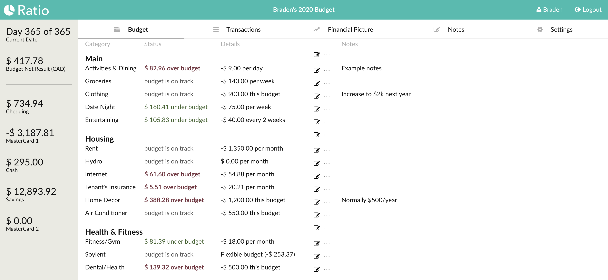
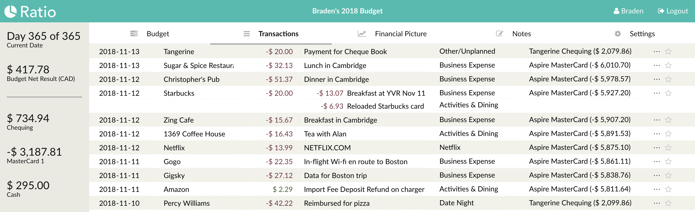

Ratio
=====

A simple application for personal budgeting, powered by [Prophecy](https://github.com/bradenmacdonald/prophecy).

You can use the hosted version at https://my.ratiobudget.com/ or host your own. Hosting your own is recommended for increased privacy and security. The hosted version comes with no warranty nor support.

Screenshots
-----------





Development Setup
-----------------

1. Install Docker (`brew cask install docker` on OS X)
1. Install [mkcert](https://github.com/FiloSottile/mkcert#installation) (On MacOS: `brew install mkcert` then `mkcert -install`)
1. Clone this repository and `cd` into this directory
1. Create the required cert with:

      ```sh
      cd .dev
      mkcert localdev.ratiobudget.net res.localdev.ratiobudget.net my.localdev.ratiobudget.net www.localdev.ratiobudget.net
      ```

1. Open this repo in VS Code.
1. Start the application with Terminal > Run Task > Run Ratio
1. Run the migrations with Terminal > Run Task > Run DB Migrations
1. Build the static files with Terminal > Run Task > Build static files
1. See the app at https://my.localdev.ratiobudget.net/

Running Tests
-------------

To run the test suite from VS Code just use Terminal > Run Task > (Backend/Frontend:) Run Tests.

Building new container images for deployment
--------------------------------------------

1. Terminal > Run Task > Backend: Build Container
1. Terminal > Run Task > Frontend: Build Container
1. Terminal > Run Task > Run Ratio (from images) -> then test that it's working at https://my.localdev.ratiobudget.net/
